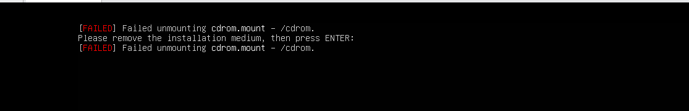

# 🐧 Session 1. 실습 환경 준비 & 파일·디렉토리 다루기

---

## 🎯 이번 세션의 목표

- 본인 PC에 Linux 실습 환경을 갖춘다
- 터미널을 두려워하지 않게 된다
- 파일·폴더를 자유롭게 탐색·생성·삭제·이동할 수 있다
- 로그 파일을 실시간으로 확인하는 방법을 익힌다

---

## 🛠️ 1. 실습 환경 준비

아래 세 가지 중 본인 환경에 맞는 방법을 선택하세요.

#### 1-1. Windows 사용자 — WSL2 (권장)

WSL2(Windows Subsystem for Linux)는 윈도우 안에서 Ubuntu를 그대로 쓸 수 있게 해줘요.

**설치 방법**

1. PowerShell을 **관리자 권한**으로 실행
2. 아래 명령어 입력

```powershell
wsl --install
```

3. 컴퓨터 재부팅
4. Ubuntu가 자동 설치되며, 사용자명·비밀번호 설정

> 💡 **팁**
> Windows 11에서는 Microsoft Store에서 "Ubuntu"를 검색해 직접 설치도 가능해요.

#### 1-2. Mac 사용자 — 기본 터미널

macOS는 Unix 기반이라 별도 설치 없이 **기본 터미널**을 그대로 사용하면 돼요.

- `Cmd + Space` → "터미널" 검색 → 실행

#### 1-3. VMware + Ubuntu Server 24.04 설치

> VMware가 이미 설치되어 있다면 1-3부터 진행하면 됩니다.

### 1-3-1. 사전 준비

**필요한 것**

- VMware Workstation Player (무료)
- Ubuntu Server 24.04 LTS ISO 파일
- MobaXterm Home Edition (무료)

### 1-3-2. VMware 다운로드 & 설치

1. [Broadcom VMware 공식 페이지](https://www.vmware.com/products/desktop-hypervisor/workstation-and-fusion) 접속
2. **VMware Workstation Player** 다운로드 (개인용 무료)
3. 설치 후 회원가입 → 로그인하여 라이선스 받기

> 💡 **참고**
> Mac 사용자는 VMware Fusion을 다운로드하세요. (M1/M2 Mac은 UTM 또는 Parallels 권장)

### 1-3-3. Ubuntu Server 24.04 ISO 다운로드

1. [Ubuntu Server 다운로드 페이지](https://ubuntu.com/download/server) 접속
2. **Ubuntu Server 24.04 LTS** 선택
3. ISO 파일 다운로드 (약 2GB — Desktop보다 훨씬 가벼움)

> ⚠️ **주의**
> Desktop이 아닌 **Server** 버전을 받으세요. 페이지 잘 확인!

### 1-3-4. VMware에 가상머신 생성

1. VMware Workstation 실행 → **Create a New Virtual Machine** 클릭
2. **Typical (recommended)** 선택 → Next
3. **Installer disc image file (iso)** 선택 → 다운로드한 Ubuntu Server ISO 선택 → Next
4. ⚠️ **Easy Install이 뜨면 무시하고 진행** (Server는 수동 설치 권장)
5. 가상머신 이름 (예: `ubuntu-server-travelhunter`)
6. **디스크 크기**: **20GB** (Server는 가벼워서 더 적게 잡아도 됨)
7. **Customize Hardware** 클릭하여 추가 설정
   - **Memory**: **2GB** (Server는 512MB도 가능하지만 여유롭게)
   - **Processors**: 2 cores
   - **Network**: NAT (기본값)
8. **Finish** → 자동으로 부팅 시작

### 1-3-5. Ubuntu Server 설치 단계

설치 화면이 검은색 텍스트 기반으로 나타나요. 화살표 키와 Enter, Tab으로 조작합니다.

**진행 순서**

1. **언어 선택** : `English` 선택 (한글은 일부 메뉴에서 깨질 수 있음)
2. **Installer Update** : `Continue without updating` (시간 절약)
3. **Keyboard** : `Korean` 또는 기본값 `English (US)`
4. **Type of install** : `Ubuntu Server (minimized)` 선택 ← **추천!**
   - minimized는 더 가벼운 버전. 필요한 패키지만 우리가 직접 설치
5. **Network** : 기본값 그대로 (자동 IP 할당)
6. **Proxy** : 비워두고 Done
7. **Mirror** : 기본값 그대로
8. **Storage**
   - `Use an entire disk` 선택
   - `Set up this disk as an LVM group` 체크 해제 (단순화)
   - Done → Continue
9. **Profile setup** ⭐ 중요
   - Your name: 본인 이름
   - Server name: `ubuntu` (호스트명)
   - Username: `ubuntu` (영문 소문자, 외우기 쉽게)
   - Password: 본인이 정한 비밀번호 (꼭 기억!)
10. **Ubuntu Pro** : `Skip for now`
11. **SSH Setup** : ⭐ **반드시 설치** 체크
    - `Install OpenSSH server` 체크
    - 나중에 호스트(Windows)에서 SSH로 접속하기 위해 필요
12. **Featured Server Snaps** : 아무것도 선택하지 않고 Done
13. 설치 진행 → 완료되면 `Reboot Now` → Enter



위 메시지가 나와도 당황하지 말고 Enter를 누르세요.

> 💡 **재부팅 시 ISO 제거 메시지**
> "Please remove installation media" 메시지가 뜨면 Enter를 누르세요. VMware가 알아서 제거해요.

### 1-3-6. 첫 로그인

재부팅 후 검은 화면에 이런 메시지가 나타나요.

```text
ubuntu-server login:
```

여기에 아래 정보를 입력합니다.

- Username: `ubuntu` (설치 시 입력한 사용자명)
- Password: 본인 비밀번호 (입력해도 화면에 안 보임 — 정상)

로그인하면 이런 화면이 보여요.

```bash
ubuntu@ubuntu-server:~$
```

🎉 **CLI 환경에 들어왔어요!**

### 1-3-7. 설치 후 초기 설정

```bash
# 1. 시스템 업데이트
sudo apt update
sudo apt upgrade -y

# 2. 필수 도구 설치
sudo apt install curl wget git vim net-tools -y

# 3. SSH 서비스 확인
sudo systemctl start ssh
sudo systemctl status ssh
# Active: active (running) 확인

# 4. 가상머신 IP 주소 확인 ⭐ (메모하세요!)
ip addr show
# 또는
hostname -I
```

**출력 예시**

```bash
ens33: ...
    inet 192.168.xxx.xxx/24 ...
```

이 IP를 메모해두세요. MobaXterm 접속에 사용합니다.

---

## 🛜 2. MobaXterm

### 2-1. 새 세션 만들기

1. MobaXterm 실행
2. 좌측 상단 **`Session`** 버튼 클릭
3. 상단 메뉴에서 **`SSH`** 선택

### 2-2. 접속 정보 입력

**Basic SSH settings**

| 항목 | 입력 |
|---|---|
| Remote host | 가상머신 IP (예: 192.168.xxx.xxx) |
| Specify username | ✅ 체크 후 `ubuntu` 입력 |
| Port | `22` (기본값) |

**Bookmark settings (선택)**

| 항목 | 입력 |
|---|---|
| Session name | `travelhunter` |

**`OK`** 클릭 → 비밀번호 입력 → 첫 접속 시 `Yes` 클릭

### 2-3. 접속 성공 화면

좌측에는 **세션 목록**, 가운데는 **터미널**, 좌측 패널 아래에는 **SFTP 파일 탐색기**가 보여요.

```bash
ubuntu@ubuntu:~$
```

🎉 SSH 접속 완료!

### 2-4. 세션 저장 & 재접속

세션을 한 번 만들어두면 **좌측 사이드바에 저장**돼요. 다음부터는

1. 좌측 `Sessions` 패널에서 저장된 세션 더블클릭
2. 비밀번호만 입력하면 즉시 접속

> 💡 **비밀번호 저장 (선택)**
> MobaXterm이 비밀번호를 기억하게 할 수 있어요. 다만 보안을 위해 마스터 패스워드 설정을 권장해요.
> Settings → Configuration → General → Master password

---

## 🖥️ 3. 터미널 첫 명령어

### 3-1. 프롬프트 이해하기

```bash
ubuntu@ubuntu:~$
```

| 부분 | 의미 |
|---|---|
| `ubuntu` | 현재 사용자명 |
| `ubuntu` | 서버명 |
| `~` | 현재 위치 (홈 디렉토리) |
| `$` | 명령어 입력 대기 |

### 3-2. 첫 명령어

```bash
echo "Hello, MobaXterm!"
lsb_release -a            # Ubuntu 버전
uname -a                  # 커널 정보
hostname                  # 호스트명
whoami                    # 현재 사용자
```

---

## 📁 4. 파일·디렉토리 다루기

### 4-1. 파일·폴더 생성

```bash
mkdir myapp                  # 폴더 생성

touch test.txt               # 빈 파일
touch a.txt b.txt c.txt      # 여러 파일 한번에
```

### 4-2. 위치 확인 & 이동

```bash
pwd                       # 현재 위치
ls                        # 파일 목록
ls -l                     # 상세 정보
ls -la                    # 숨김 파일까지 (실무 표준)

cd /var/log               # 절대 경로 이동
cd ..                     # 상위 폴더
cd ~                      # 홈 디렉토리
```

### 🧪 실습 1

```bash
pwd
ls -la
cd /tmp
pwd
cd ~
```

### 4-3. 복사·이동·삭제

```bash
cp a.txt b.txt               # 파일 복사

mv old.txt new.txt           # 이름 변경
mv file.txt /tmp/            # 이동

rm test.txt                  # 파일 삭제
rm -rf folder/               # 폴더 강제 삭제
```

> ⚠️ **위험 경고**
> `rm -rf /` 는 **시스템 전체 삭제**예요. `rm -rf` 를 쓸 때는 경로를 두 번 확인하세요. **휴지통이 없어요!**

### 🧪 실습 2

```bash
# 1. 연습 폴더 생성
cd ~
mkdir linux_practice
cd linux_practice

# 2. 파일 3개 생성
touch hello.txt world.txt readme.md

# 3. 폴더 구조 만들기 (-p: 부모폴더까지 만들어주는 옵션)
mkdir -p project/src/api

### mkdir로도 해보기 (안될것임)

# 4. 파일 이동
mv hello.txt project/

# 5. 파일 복사
cp world.txt project/src/

# 6. 이름 변경
mv readme.md README.md

# 7. 구조 확인
ls -la
ls -la project/

# 8. 정리
cd ~
rm -rf linux_practice
```

---

## 👀 5. 파일 내용 보기

nginx 웹서버를 설치해서 로그 파일 확인을 실습합니다.

### 5-0. nginx 설치

**1️⃣ nginx 설치**

Ubuntu 기준:

```bash
sudo apt update
sudo apt install nginx -y
```

**2️⃣ nginx 실행**

```bash
sudo systemctl start nginx
```

상태 확인:

```bash
sudo systemctl status nginx
```

**3️⃣ 브라우저에서 접속**

`http://localhost` 또는 서버 IP로 접속합니다.

페이지를 한 번만 열어도 로그가 생성되고, 여러 번 새로고침하면 로그가 쌓입니다.

**4️⃣ 로그 파일 위치**

```bash
cd /var/log/nginx
ls
```

보통 이 2개가 있습니다.

- `access.log` 👉 요청 기록
- `error.log` 👉 에러 기록

### 5-1. 전체 보기 — cat

```bash
ubuntu@ubuntu:/var/log/nginx$
cat access.log              # 파일 내용 전체 출력
```

### 5-2. 페이지 단위로 보기 — less

```bash
ubuntu@ubuntu:/var/log/nginx$
less access.log
```

조작키

- `Space` : 다음 페이지
- `b` : 이전 페이지
- `/검색어` : 검색
- `q` : 종료

### 5-3. 앞부분만 보기 — head

```bash
ubuntu@ubuntu:/var/log/nginx$
head access.log             # 처음 10줄
head -n 20 access.log       # 처음 20줄
```

### 5-4. 뒷부분만 보기 — tail

```bash
ubuntu@ubuntu:/var/log/nginx$
tail access.log             # 마지막 10줄
tail -n 50 access.log       # 마지막 50줄
tail -f access.log          # 실시간으로 따라가기 ⭐️
```

> 💡 **실무 꿀팁 — tail -f**
> 배포 후 로그를 실시간으로 보는 가장 자주 쓰는 명령어예요. 에러가 발생하는 순간을 바로 확인할 수 있어요.
> 종료는 `Ctrl + C`

### 🧪 실습 3

```bash
# 1. 시스템 로그 파일 위치로 이동
cd /var/log

# 2. 파일 목록 확인
ls -la

# 3. 시스템 로그 처음 50줄 확인
sudo journalctl | head -n 50

# 4. 마지막 50줄 확인
sudo journalctl -n 50

# 5. 실시간 로그 모니터링 (Ctrl+C로 종료)
sudo journalctl -f

# 6. 방금 발생한 에러 확인
sudo journalctl -p err
# -p (priority) 옵션
```

- **`journalctl`**: "시스템이 켜지자마자 일어난 모든 일"을 가장 깊숙한 곳에서 꺼내온 것. systemd 기반 시스템에서 기본적으로 로그 관리
- **`syslog`**: "서비스가 돌아가기 시작하면서 정리된 기록"을 파일에서 읽어온 것.

---

## 🔍 6. 명령어 도움말 보기

명령어 사용법이 헷갈릴 때 활용하세요.

```bash
ls --help                # 간단한 도움말
man ls                   # 상세 매뉴얼 (q로 종료)
```

---

## 📋 7. 한 장 요약

| 명령어 | 동작 |
|---|---|
| `pwd` | 현재 위치 |
| `ls -la` | 파일 목록 (상세 + 숨김 포함) |
| `cd 경로` | 폴더 이동 |
| `mkdir -p 경로` | 폴더 생성 (중간 경로 포함) |
| `touch 파일` | 빈 파일 생성 |
| `cp -r 원본 대상` | 복사 (폴더는 -r) |
| `mv 원본 대상` | 이동·이름 변경 |
| `rm -rf 폴더` | 강제 삭제 (⚠️ 주의) |
| `cat 파일` | 전체 보기 |
| `less 파일` | 페이지 단위 보기 |
| `head -n N 파일` | 처음 N줄 |
| `tail -f 파일` | 실시간 로그 따라가기 |

---

## 🏠 과제

1. 홈 디렉토리에 `study` 폴더를 만들고, 그 안에 `day1`, `day2`, `day3` 하위 폴더를 한 번에 생성해보세요.
2. `day1` 폴더 안에 `note.txt` 파일을 만들고, 다른 폴더에 복사해보세요.
3. `sudo journalctl -f` 로 시스템 로그를 1분간 모니터링해보고, 어떤 메시지가 나오는지 확인해보세요.
