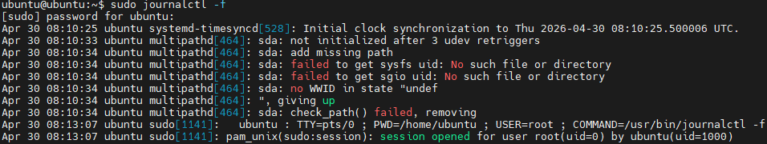

# Linux 시스템 로그 요약: journalctl -f

## 0. 로그 캡쳐

아래 이미지는 `sudo journalctl -f` 명령어 실행 결과이다.

## 1. journalctl -f

`journalctl -f`는 systemd 로그를 실시간으로 확인하는 명령어이다.

- `jounalctl`: systemd 로그 확인
- `-f`: 새 로그를 계속 출력
- 용도: 시스템 동작, 오류, 인증 기록 확인

## 2. systemd-timesyncd 로그

`systemd-timesyncd`는 시스템 시간을 동기화하는 데몬이다. 

로그 의미:

- 시스템 시간이 NTP 서버와 동기화됨
- 부팅 후 최초 시간 보정이 수행됨

판단: 

- 정상 로그
- 별도 조치 필요 없음

## 3. multipathd 로그

`multipathd`는 여러 스토리지 경로를 관리하는 데몬이다.

로그 의미:

- `multipathd`가 `/dev/sda` 디스크를 검사함
- WWID를 찾지 못함
- multipath 관리 대상이 아니라고 판단하고 제거함

관련 용어:

| 용어 | 의미 |
|---|---|
| `multipathd` | 스토리지 다중 경로 관리 데몬 |
| `/dev/sda` | 첫 번째 디스크 장치 |
| WWID | 스토리지 고유 식별자 |
| sysfs | `/sys` 아래의 커널 장치 정보 |
| SG_IO | SCSI 장치 정보 조회 방식 |
| udev | 리눅스 장치 관리 시스템 |

판단:

- VMware Ubuntu 실습 환경에서는 대부분 무시 가능
- 일반 가상 디스크가 multipath 대상이 아니어서 발생할 수 있음
- 디스크 장애라고 단정하면 안 됨

## 4. sudo / pam_unix 로그

`sudo`와 `pam_unix` 로그는 권한 상승과 인증 세션 기록이다.

로그 의미:

- `ubuntu` 사용자가 `sudo`로 root 권한을 얻음
- `journalctl -f` 명령어를 실행함
- root 세션이 정상적으로 열림

주요 항목:

| 항목 | 의미 |
|---|---|
| `USER=root` | root 권한으로 실행 |
| `COMMAND` | 실행한 명령어 |
| `TTY=pts/0` | 터미널 세션 |
| `uid=0` | root 사용자 ID |
| `uid=1000` | 일반 사용자 ID |

판단:

- 정상적인 감사 로그
- 누가 어떤 명령을 실행했는지 기록한 것

## 5. 전체 결론

| 로그 종류 | 의미 | 판단 |
|---|---|---|
| `systemd-timesyncd` | 시간 동기화 | 정상 |
| `multipathd` | 디스크를 multipath 대상으로 검사 후 제외 | VM 환경에서는 보통 정상 |
| `sudo` | root 권한 명령 실행 | 정상 |
| `pam_unix` | sudo 세션 열림 | 정상 |

## 6. 핵심 암기

- `journalctl -f`는 시스템 로그를 실시간으로 보는 명령어이다.
- `systemd-timesyncd`는 시간 동기화 로그이다.
- `multipathd`는 스토리지 다중 경로 관리 데몬이다.
- VMware 실습 환경에서 `multipathd`의 WWID 관련 로그는 대부분 무시 가능하다.
- `sudo`와 `pam_unix` 로그는 사용자가 root 권한으로 명령을 실행했다는 기록이다.
- 위 로그들은 인터넷 연결 문제와 직접적인 관련은 없다.